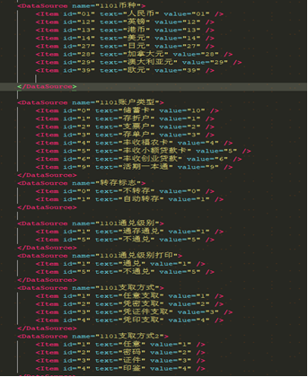
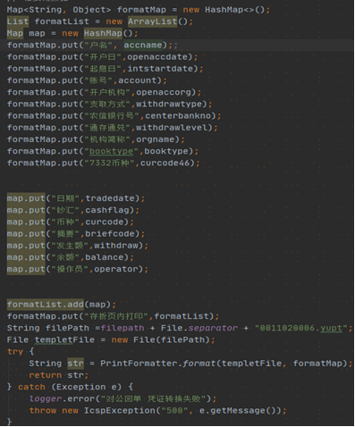
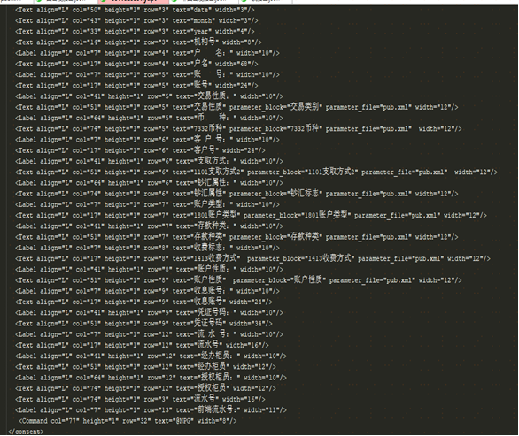
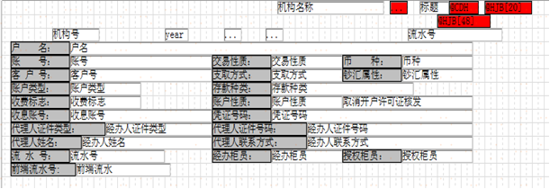

# 凭证打印实现流程

支持设备列表

| **设备名称** | **型号** | **完成度** |
| :------------ | :------------ |:------------ |
| 富士通存折打印机 | DPK2000G | 完成并测试通过 |

## 一、 涉及场景、业务

涉及凭证或者其他需要打印的场景。

## 二、 方法阐述

1. 打印数据

```javascript
/**
 * 打印数据
 * @param {*} templateId 模板id
 * @param {*} params     模板数据
 */
print(templateId, params) {
    fox.dev.printer
        .print(this, templateId, params)
        .then((response) => {
            console.debug(response)
        })
        .catch((error) => {
            console.error(error)
        })
}
```

2. 打印预览

```javascript
/**
 * 打印预览
 * @param {*} templateId 模板id
 * @param {*} params     模板数据
 */
preview(templateId, params) {
    fox.dev.printer
        .preview(this, templateId, params)
        .then((response) => {
            console.debug(response)
        })
        .catch((error) => {
            console.error(error)
        })
}
```

## 三、 打印模板生成相关

> - 打印模板需要按照格式自行生成，具体使用方法请参考 [《YUPT编辑器使用文档》](/docs/icsp-front/icsp-front-1e0d622ep9vvj)；
- 模板生成后需要上传的位置，请 RTX 或者企业微信`@徐建峰`处理；
- 先前的打印业务，老柜面有现成的模板，可以联系自己的业务确定。

1. 如有需要配数据字典，则需要在 pub.xml 文件中进行字典翻译项添加，pub.xml文件需要放置于打印服务所部署服务器的指定路径（具体路径参考apollo配置）。如下图所示：一个`DataSource`标签表示一个字典项，`name` 属性为字典项的属性名称，如币种、账户类型等；`Item`标签中为具体属性值，根据业务需求进行配备，`id`属性与`value`属性一致。

 


2. 若新增一种模板文件，后台代码则需要重新对前端上送数据进行取值，并在遍历模板信息时需要新增模板文件信息如下图：

 

 将需要的值都填充完之后，后台会根据所指定的模板文件转成指定格式，经后台转换后为如下样式的加密报文返回给前端.

 

 