# hexo 搭建博客

## 一、准备

### 1、环境

- 安装node
```shell
node -v # v16.16.0

npm -v # 8.11.0
```
- 安装git
```shell
 git --version # git version 2.32.1 (Apple Git-133)
```

### 2、账号
- github [注册](https://github.com/)

## 二、安装 hexo 工具

```shell
npm install -g hexo-cli # 全局安装
```

## 三、建站

```shell
hexo init <folder>
cd <folder>
npm install # yarn
```

- 目录
```shell
.
├── _config.yml
├── package.json
├── scaffolds
├── source
|   ├── _drafts
|   └── _posts
└── themes
```

- 本地启动
```shell
npm run server # yarn server
```

## 四、[配置](https://hexo.io/zh-cn/docs/configuration#%E7%BD%91%E5%9D%80)

您可以在 _config.yml 中修改大部分的配置。

### 1、网站

```shell
# Site
title: 520wsl
subtitle: 'Love Love Love'
description: '是谁给你的勇气？？？梁静茹吗？'
keywords: vue javascript python php
author: Mad Dragon
language: zh-CN
timezone: 'Asia/Shanghai'
```

|参数|	描述|
|:--:|:---|
|title|	网站标题|
|subtitle|	网站副标题|
|description|	网站描述|
|keywords|	网站的关键词。支持多个关键词。|
|author|	您的名字|
|language|	网站使用的语言。对于简体中文用户来说，使用不同的主题可能需要设置成不同的值，请参考你的主题的文档自行设置，常见的有 zh-Hans和 zh-CN。|
|timezone|	网站时区。Hexo 默认使用您电脑的时区。请参考 时区列表 进行设置，如 America/New_York, Japan, 和 UTC 。一般的，对于中国大陆地区可以使用 Asia/Shanghai。|

### 2、网址

```shell
# URL
## Set your site url here. For example, if you use GitHub Page, set url as 'https://username.github.io/project'
url: http://520wsl.github.io
permalink: :year/:month/:day/:title/
permalink_defaults:
pretty_urls:
  trailing_index: true # Set to false to remove trailing 'index.html' from permalinks
  trailing_html: true # Set to false to remove trailing '.html' from permalinks
```


|参数|描述|默认值|
|:--:|:---|:--:|
|url|网址, 必须以 http:// 或 https:// 开头||
|root|	网站根目录	|url's pathname|
|permalink|	文章的 永久链接 格式|	:year/:month/:day/:title/|
|permalink_defaults|	永久链接中各部分的默认值	||
|pretty_urls|	改写 permalink 的值来美化 URL	||
|pretty_urls.trailing_index	|是否在永久链接中保留尾部的 index.html，设置为 false 时去除	|true|
|pretty_urls.trailing_html|	是否在永久链接中保留尾部的 .html, 设置为 false 时去除 (对尾部的 index.html无效)|	true|

## 五、ssh 密钥、公钥生成（SSH Keys）

### 1、检查是否安装ssh

```shell
wangshilin@wangshilindeMacBook-Pro git % ssh
usage: ssh [-46AaCfGgKkMNnqsTtVvXxYy] [-B bind_interface]
           [-b bind_address] [-c cipher_spec] [-D [bind_address:]port]
           [-E log_file] [-e escape_char] [-F configfile] [-I pkcs11]
           [-i identity_file] [-J [user@]host[:port]] [-L address]
           [-l login_name] [-m mac_spec] [-O ctl_cmd] [-o option] [-p port]
           [-Q query_option] [-R address] [-S ctl_path] [-W host:port]
           [-w local_tun[:remote_tun]] destination [command]
wangshilin@wangshilindeMacBook-Pro git % 
```

### 2、生成ssh keys

```shell
ssh-keygen -t rsa -C "your email@example.com"
# 引号里面填写你的注册时的邮箱地址，比如xxxxxxxx@163.com
```
【第一次回车】之后会出现：

```shell
Generating public/private rsa key pair.
Enter file in which to save the key (/Users/wangshilin/.ssh/id_rsa):   
# 到这里可以直接回车将密钥按默认文件进行存储
```

【第二次回车】然后会出现：

```shell
Enter passphrase (empty for no passphrase):
# 这里是要你输入密码，其实不需要输什么密码，直接回车就行
Enter same passphrase again:
# 再回车
```

【第三次回车、第四次回车】接下来屏幕会显示：

```shell
Your identification has been saved in /Users/wangshilin/.ssh/id_rsa
Your public key has been saved in /Users/wangshilin/.ssh/id_rsa.pub

The key fingerprint is:
# 这里是各种字母数字组成的字符串，结尾是你的邮箱
SHA256:xxxxxxxxxxxx xxxxxxx@163.com

The key's randomart image is:
# 这里也是各种字母数字符号组成的字符串
+---[RSA 3072]----+
|   .             |
|  + .            |
|   O +       .   |
|  + / o     . .  |
|   % X .S  o .   |
|    O . ..+ .o . |
|     . .oo =+ =  |
|      ..Eoooo+ +.|
|        . oooo+o+|
+----[SHA256]-----+
```

四次回车后，我们的SSH keys就已经生成了，存在C:/Users/自己电脑的用户名（如未新建，默认是Administrator）/.ssh/id_rsa.pub文件中。

## 六、在GitHub账户中添加你的公钥

### 1、登陆github，进入Settings
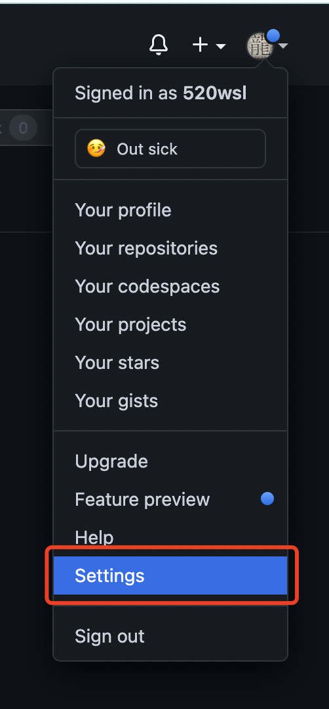
### 2、点击 SSH and GPG Keys：
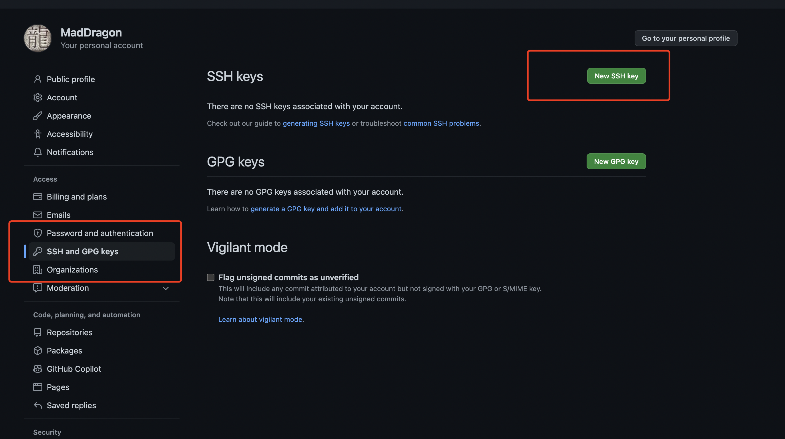
### 3、选择 New SSH key
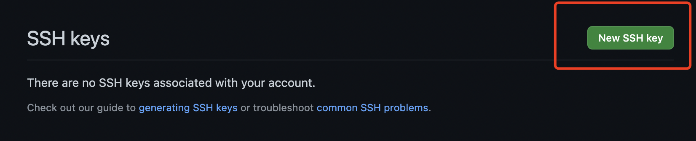
### 4、添加SSH keys步骤如图
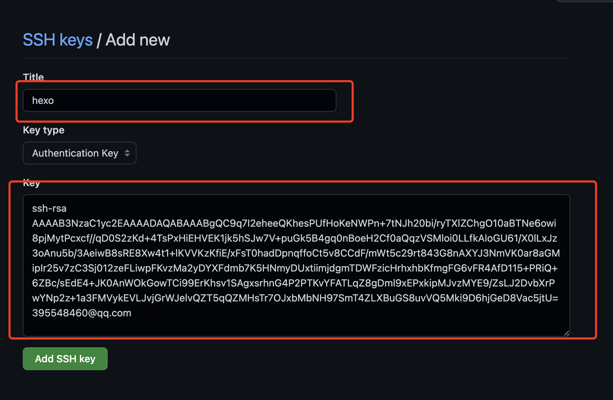

- Title随便写
- Key ssh生成的公钥，id_rsa.pub的内容复制粘贴过来

### 5、测试SSH是否绑定成功
输入以下命令：注意：git@github.com不要做任何更改！

```shell
ssh -T git@github.com
```
回车，再次输入yes后回车，就会显示：
```shell
wangshilin@wangshilindeMacBook-Pro git % ssh -T git@github.com
Hi 520wsl! You've successfully authenticated, but GitHub does not provide shell access.
wangshilin@wangshilindeMacBook-Pro git % 
```

### 6、配置Git个人信息
Git 会根据用户的名字和邮箱来记录提交，GitHub 也是用这些信息来做权限的处理，输入以下命令进行个人信息的设置，把名称和邮箱替换成自己的，名字可以不是GitHub的昵称，但为了方便记忆，建议与GitHub一致。

```shell
git config --global user.name "此处填你的用户名"
git config --global user.email "此处填你的邮箱"
```
## 七、生成 github令牌

### 1、登陆github，找到Settings中的Developer settings(开发者设置)，其中有一个Personal access tokens，点进去就可以Generate new token了。
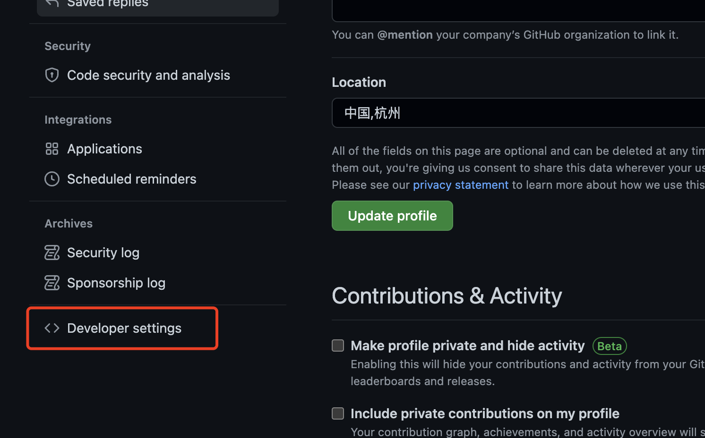
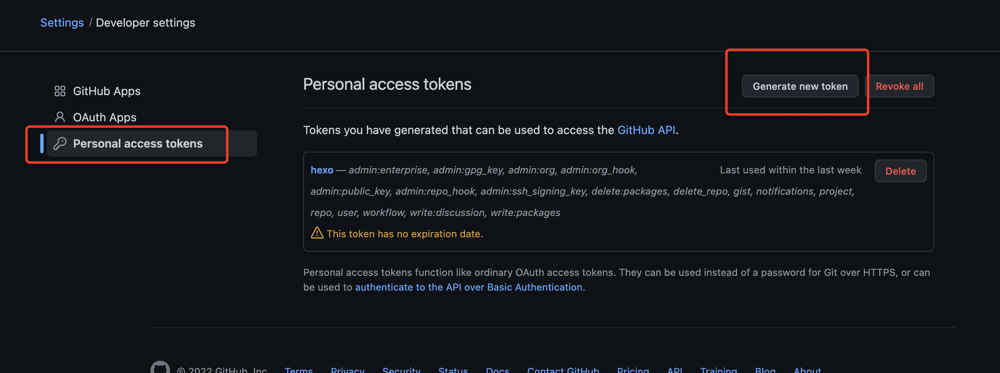

### 2、生成令牌
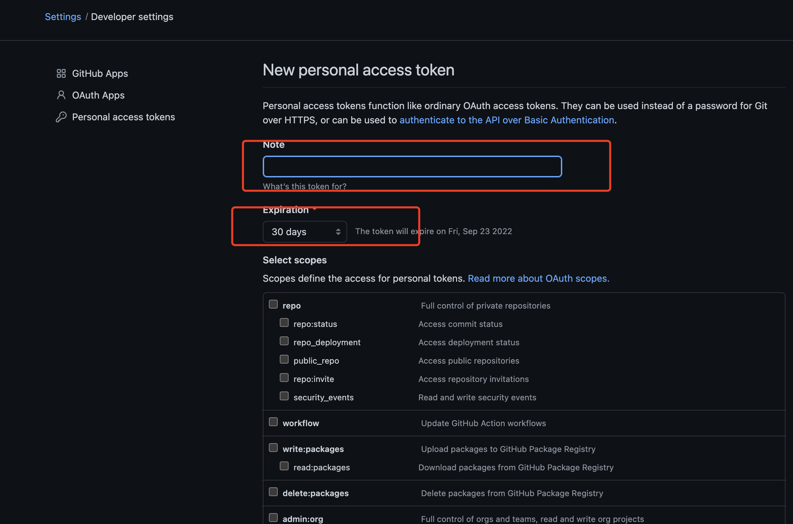
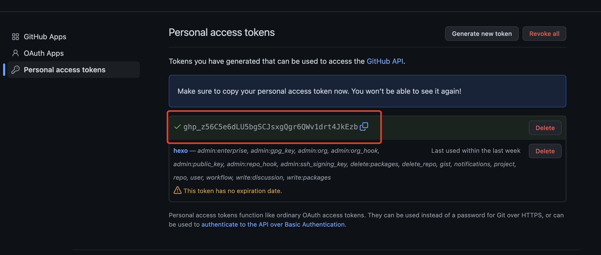
Select scopes 最好全选

点击Generate token后，会显示生成的一段代替密码的序列号，一键复制之后将它存在方便找到的地方，因为下一次使用令牌时这里的序列号将被隐藏。


## 八、Hexo发布

### 1、创建和你github登陆名同名的项目  yourname.github.io
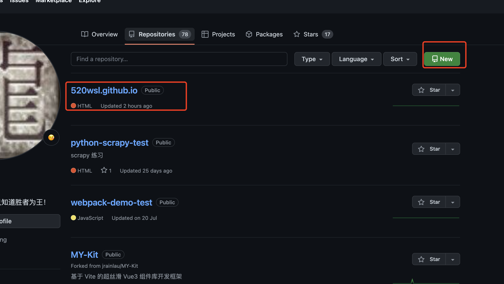

### 2、复制项目地址


### 3、打开 hexo项目的_config.yml 文件，将该文件最底部的deploy关键字代码：
```shell
deploy:
  type: 
```
修改为（注意：所有英文冒号后面都有一个空格, repository后面的是获取到的仓库地址）

```shell
deploy:
  type: git
  repository: https://github.com/xxx/xxx.github.io.git
  branch: main
```

### 4、安装hexo-deployer-git自动部署发布工具，即将hexo 部署到 git page 的 deployer

```shell
npm install hexo-deployer-git --save # yarn add hexo-deployer-git
```

### 5、推送到github

```shell
hexo clean && hexo deploy
```

### 6、推送后会提示填写用户名和密码

- 用户名是github的用户名
- 密码是上面生产的令牌（注意不是github的密码）

### 7、如下类似提示 推送成功

```shell
wangshilin@wangshilindeMacBook-Pro 520wsl % hexo clean && hexo deploy 
INFO  Validating config
...
...
Enumerating objects: 34, done.
Counting objects: 100% (34/34), done.
Delta compression using up to 10 threads
Compressing objects: 100% (26/26), done.
Writing objects: 100% (34/34), 881.81 KiB | 15.20 MiB/s, done.
Total 34 (delta 4), reused 0 (delta 0), pack-reused 0
remote: Resolving deltas: 100% (4/4), done.
To https://github.com/520wsl/520wsl.github.io.git
 + a989e62...6690edd HEAD -> main (forced update)
Branch 'master' set up to track remote branch 'main' from 'https://github.com/520wsl/520wsl.github.io.git'.
INFO  Deploy done: git
wangshilin@wangshilindeMacBook-Pro 520wsl % 
```

## 九、Github Pages 设置

### 1、进入仓库，找到Settings，向下翻最后面有Github Pages，点击Check it out here
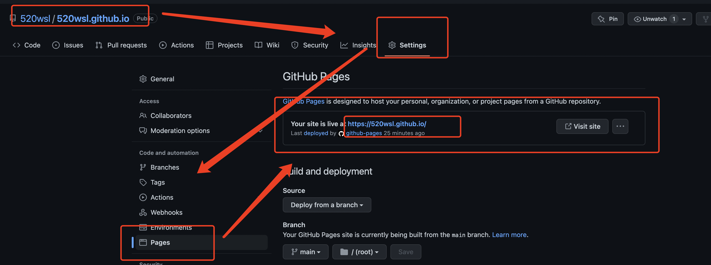

### 2、打开 https://youname.github.io/
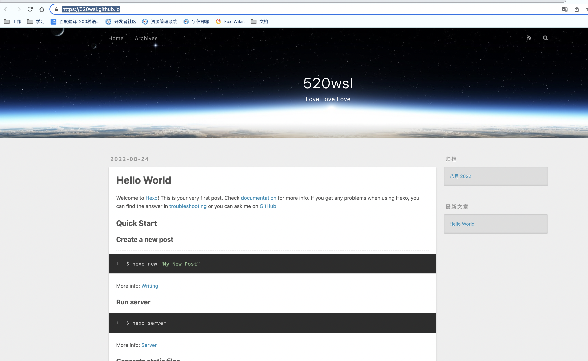

好了，现在你的博客可以被人看见了。开心吧😄