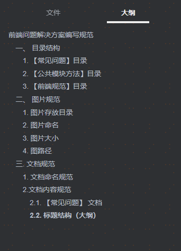
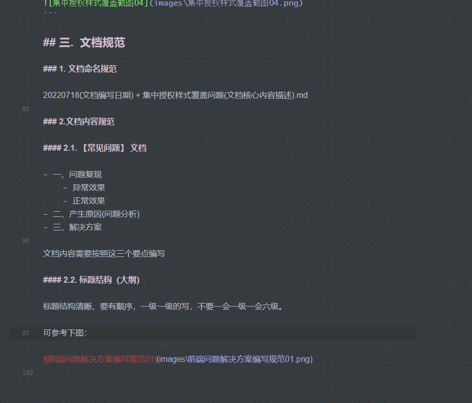

# 前端问题解决方案编写规范

## 一、 目录结构

```
- Docs

-- 常见问题
--- images
--- 20220718 集中授权样式覆盖问题.md
--- 20220720 解决代码合并冲突问题.md

-- 公共模块方法
-- images
--- 20220720 凭证打印.md

-- 前端规范
-- images
--- 20220721 前端问题解决方案文档编写规范

-- 业务知识
-- images
--- 20220726 发起集中授权任务及捞任务操作步

```

### 1. 【常见问题】目录

用来存放开发过程中产生的bug问题收集，以及解决方案。

### 2. 【公共模块方法】目录

用来存放fox项目的一些公共方法介绍文档，以及使用步骤。

### 3. 【前端规范】目录

用来存放前端开发规范文档。

### 4.【业务知识】

用来存放交易相关业务知识、交易需求分析等。

## 二、 图片规范 

### 1. 图片存放目录

图片存放在 xxx/images 文件夹

### 2.  图片命名

```
-- images
--- jQuery问题01.png
--- jQuery问题02.png
--- 集中授权样式覆盖截图01.png
--- 集中授权样式覆盖截图02.png
```

命名需要和所编写的文档文件名保持一致，多张图片一数字区分

`集中授权样式覆盖截图(文档名称) + 01(数字).png`

```
// 错误写法
集中授权样式覆盖截图-01.png
集中授权样式覆盖截图_01.png

// 正确写法
集中授权样式覆盖截图01.png
```

### 3. 图片大小

使用的图片不允许超过1M大小

### 4. 图路径

文档中图片路径使用相对路径

 错误写法

```markdown

```

 正确写法

```markdown

```

-  [] 内文字和图片名保持一致 ``

  如：``

## 三.  文档规范

### 1. 文档命名规范

20220718(文档编写日期) + 集中授权样式覆盖问题(文档核心内容描述).md

```
20220718 集中授权样式覆盖问题.md
```

### 2.文档内容规范

#### 2.1. 【常见问题】 文档

- 一、问题复现
	- 异常效果
	- 正常效果
- 二、产生原因(问题分析)
- 三、解决方案

文档内容需要按照这三个要点编写

#### 2.2. 标题结构（大纲）

标题结构清晰、要有顺序，一级一级的写，不要一会一级一会六级。

可参考下图：




