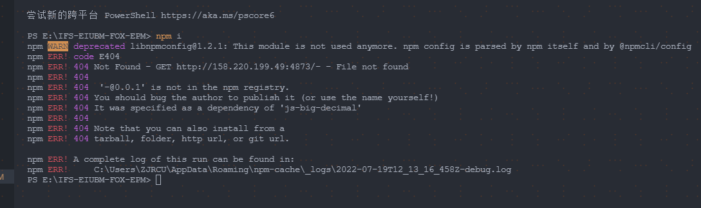
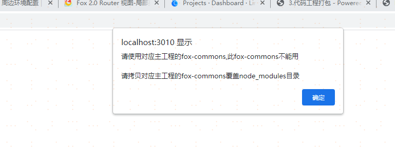
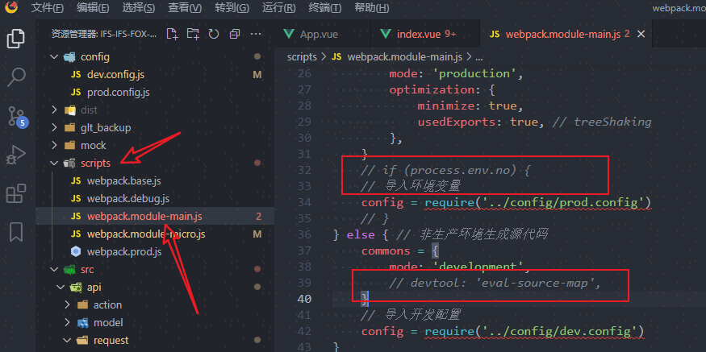
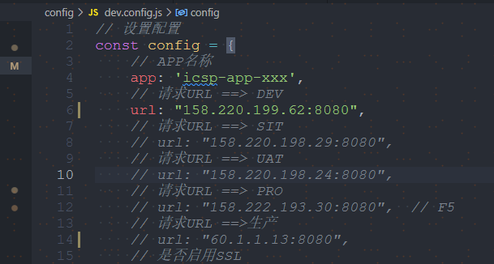

# 子工程启动项目

## 一、拉取代码

```
git clone 地址
```

## 二、安装依赖

```
npm i
```

###   安装依赖报错



1. 在package.json文件中删除 js-big-decimal

2. ```shell
   /* 运行代码 */
   npm i @fox-js/flow@legacy @fox-js/fox@legacy @fox-js/foxui-pc@legacy @fox-js/micro-app@legacy @fox-js/plugins@legacy @fox-js/validator@legacy
   ```

3. ```shell
   npm i
   ```

## 三、项目跑起来后，此时可能看不到登录页面



此时要到主工程里面打包一份fox-commons.js，放进子工程node_modules/fox-commons文件里

### 打包fox-commons.js步骤



- 在scripts文件中找到webpack.module-main.js文件，将此文件中的红框框选的注释

- 在config文件中找到dev.config.js，切换到对应环境

  

- 运行npm run main:dev命令进行打包

- 打包完成后会生成一个dist文件，fox-commons.js就在这个文件中