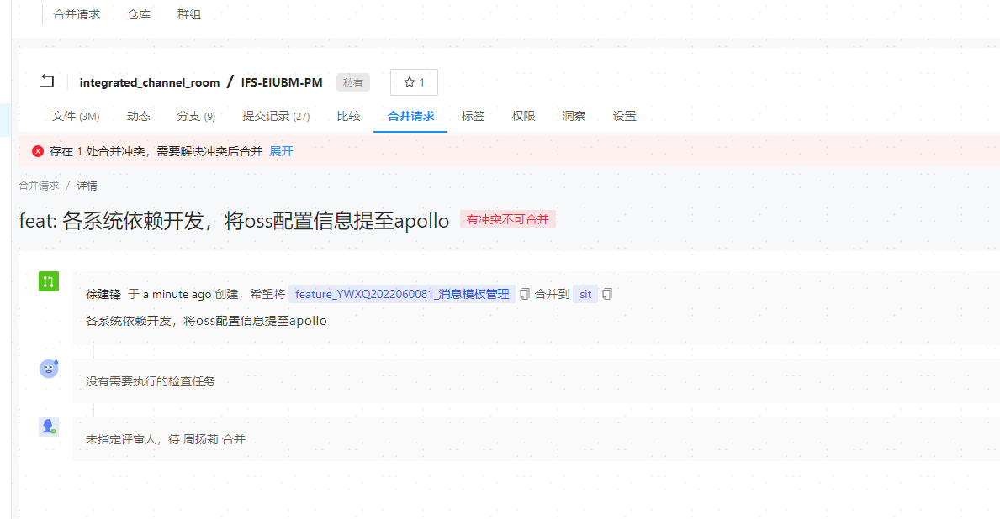

## 代码平台合并分支遇到的代码冲突问题解决

#### 一、问题复现

​	提交本地代码后，在代码平台合并分支时会遇到代码冲突的问题



#### 二、出现原因

因为当前分支与目标分支存在代码差异，git pull只能保证当前分支代码为最新的，所以需要从目标分支拉取最新代码

#### 三、解决方案

1. 首先需要执行git fetch origin xxx到你想要提取代码的分支上，并获取xxx分支上有你没有的的数据
2. 执行git merage 别名/分支名 将更新合并到你的当前分支
3. 解决冲突，重新提交即可

```js
// 例：拉取sit分支代码并更新到当前分支
1. git fetch origin sit
2. git merage origin/sit
```
