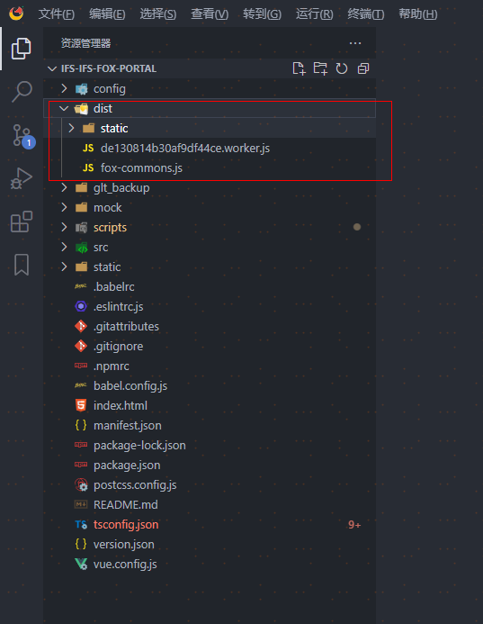

# 主工程与子工程打包

## 一、主工程打包

1、切换分支到：平台体系搭建-基础功能

2、安装依赖

```
npm i
```

3、scripts文件夹：mian.js和micro.js中的devtool:'eval-source-map'注释掉

4、打包：

```
npm run main:dev
```

5、生成打包文件

打包完成后在根目录自动生成打包文件dist目录



## 二、子工程打包

1、运行 

```
npm run micro:dev
```

2、生成打包文件

打包完成后在根目录自动生成打包文件dist目录
