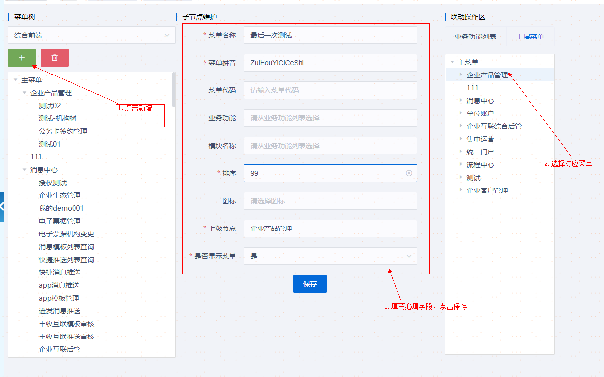
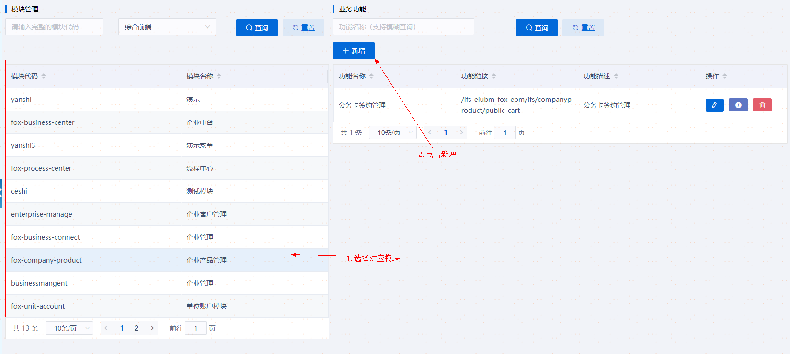
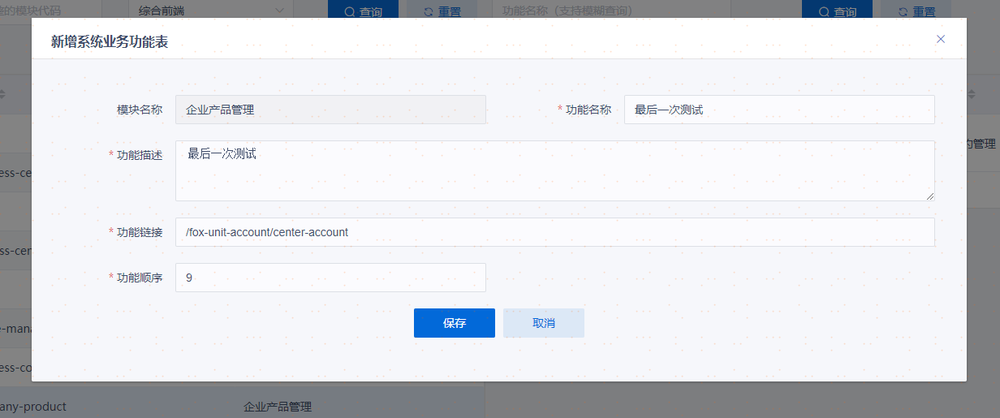
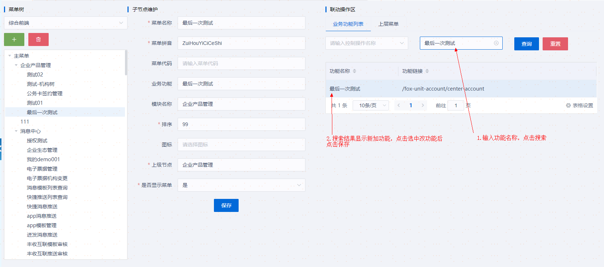
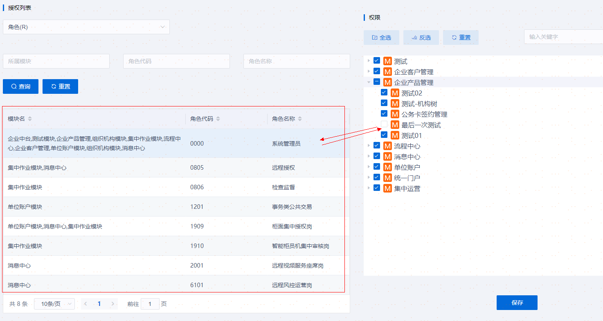

# 菜单配置流程

## 一、登录综合服务门户平台

admin账号登录综合服务门户平台 网址地址：http://158.220.199.49:8081/icsp/

## 二、进入 统一门户-权限管理-菜单管理

如果所示：

根据图片步骤完成对应操作，点击保存

## 三、进入 统一门户-权限管理-功能管理

在弹出新增系统业务功能表中加入相应字段、点击保存，如图所示：

## 四、再次进入 统一门户-权限管理-功能管理

输入刚刚新增的系统业务功能，点击查询后，选择对应的功能名称，点击保存即可完成绑定

## 五、进入 统一门户-权限管理-功能授权

选择相对应的模块，进行权限分配，点击保存，重新登录账号即可

